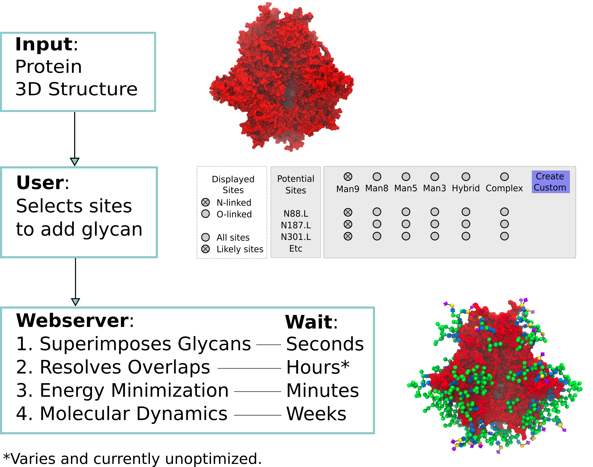

# GlycoProteinBuilder
Uses GEMS/GMML to add and adapt 3D structures of N-glycans and O-glycans onto glycoproteins. It can do this for Asn, Ser, Thr and Tyr.

## Schematic

### Notes
Project is under development, contact olivercgrant "at" gmail.com with queries. 
This code is intended to replace the glycoprotein builder currently available on glycam.org/gp. You can compile and run it locally.
Has been tested on linux, but might install on both Mac and Windows.

### Prerequisites

You'll need GMML: [Click here for installation instructions](https://github.com/GLYCAM-Web/gmml#readme)

### Installation of GlycoProteinBuilder
    cd gmml/tests/
    GMML_ROOT_DIR=$(git rev-parse --show-toplevel) # assumes you have cloned the gmml repo using git.
    g++ -std=c++17 -I "${GMML_ROOT_DIR}" -L"${GMML_ROOT_DIR}"/bin/ -Wl,-rpath,"${GMML_ROOT_DIR}"/bin/ "${GMML_ROOT_DIR}"/internalPrograms/GlycoproteinBuilder/main.cpp -lgmml -pthread -o gpBuilder

### Testing
Once compiled, you can run:

./gpBuilder tests/inputs/017.GlycoproteinBuilderInput.txt 

### Setup
Edit or create an input.txt file. See tests/inputs/017.GlycoproteinBuilderInput.txt for an example.

You must provide:

    A protein 3D structure
    A Glycan 3D structure(s) or sequences in GLYCAM condensed nomenclature (just like the carb builder here: glycam.org/cb)
    An input.txt, which contains:
        protein file name
        the protein residue numbers you want to attach to (no automatic detection of sequons)
        the glycan you want to attach in Glycam condensed sequence format.

## Algorithm
This is regularly being tweaked. Right now it's a combination of random movements and "wiggling" (grid searching within the known ranges of the glycosidic bonds).

## Development Notes 2023-10-25 (users can ignore everything below here)
#### Current timings
Updating the overlap residues considered by each linkage is costly. Need to figure out if it's worth doing it during the algo for big systems, or to just do all atoms at the end.

    E.g FVIIItbg.pdb: 
        Before this merge: 2hrs. 
        With closest 20 protein residues and all atoms for the last wiggle only: 29 min. #This is what is implemented.
        With closest 20 protein residues and update closest 20 residues for last wiggle only: 30min
        with closest 20 protein residues and no update or no all atom for last wiggle: 16min. # faster, but I'm worried about overlaps existing that we don't see
    The speedups are the same for putting out 30 epo structures. Updating which residues get considered needs to be faster, the only thing thats changing is the protein, but the 
    current code is recalcs everything. If it was instead storing a ref to a vector, could just update closest N residues in that vector.

#### Future directions
Validation by comparing to NMR structures.

Linkages: Do you need to search both directions when looking for overlap residues, or is it more efficient to extract from a vector of everything and put the remainder in the other direction vector?

Would closest N protein residues to NLN work for each linkage in a glycosite, and can you just have a ref to them in the linkage? A vector of ptrs to the other glycosite residues and proteinWithinX vectors? Messy, but much faster?

Considering only close / closest N glycosites needs to come back. Scaling issues will come from not doing this
